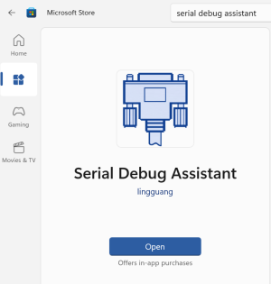
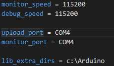

# Firmware Examples

Examples of how to use different drivers for Software Logistics Open Hardware Platform

## Getting started with our hardware

  * Plug in the NuvIot sensor board and determine which com port is is connecting on.

# VS Code - Windows

## Clone the repository
  * GitHub: https://github.com/softwarelogistics/FirmwareExamples
  * This repository contains all of our examples.

## Install PlatformIO Extension

  * We use the VS Code Extension, PlatformIO IDE which is an open source and widely used for embedded development. More information can be found at: https://docs.platformio.org/en/latest/integration/ide/vscode.html

## Install Serial Debug Assistant

  * Another tool we have found useful the Serial Debug Assistant which can be downloaded from the Microsoft Store. Search for "serial debug assistant". This is not needed for basic operations or use of the firmware but will come in handy as you work with the hardware.

  * 

## Setup

  * Open the folder of the sample you want to use and edit "platformio.ini"

### NuvIot LIbraries

  * Make sure that you have downloaded the NuvIot libraries and that the entry in platformio.ini points to the correct place on your machine.

### COM port and speed

  * You will also need to set the com port and com port speed.
  * The related platformio.ini entries for my machine are shown below:

   * 

## Using the firmware

  * Open the example you want to use
  * Build the project - A file with extension .elf (https://en.wikipedia.org/wiki/Executable_and_Linkable_Format) is generated.
  * Upload the project

## Summary of Examples, a work in progress!

* ### NuvIot Sensor
  * A simple monitor of temperature and humidity
  * https://github.com/softwarelogistics/FirmwareExamples/NuvIoT-SensorBoard

